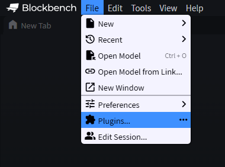
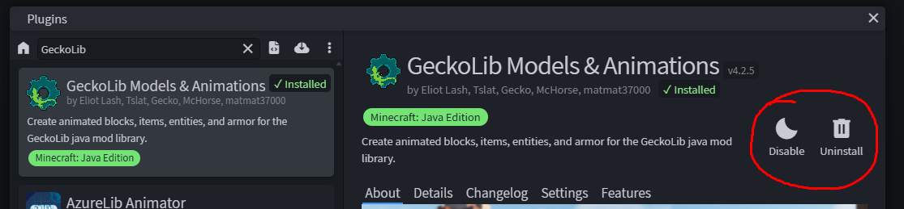
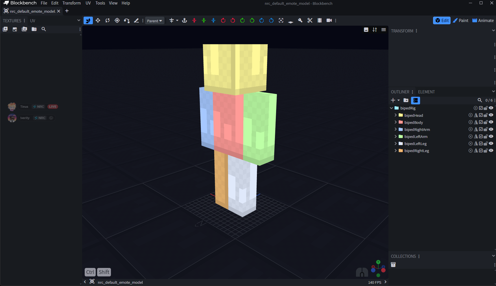

# 1. Grundlagen

← [Home](Home) · **1 / 12** · [Aufbau →](02-Aufbau)

---

Bevor du loslegst, brauchst du eine funktionierende Blockbench-Installation mit dem **GeckoLib-Plugin** und unserem **NRC Default Template**. Diese drei Dinge bilden die Basis für *alles* was danach kommt.

## Blockbench

Blockbench ist ein kostenloses Open-Source 3D-Modeling-Programm, welches unter anderem auch von Minecraft selber benutzt wird. Du kannst es entweder als **WebApp** (nicht zu empfehlen) oder als **Desktop-Programm** nutzen.

🔗 https://www.blockbench.net/

## GeckoLib

GeckoLib ist ein Plugin für Blockbench und wir nutzen es um unsere Cosmetics & Emotes zu erstellen und zu exportieren. Um es zu installieren:

1. Öffne Blockbench
2. Oben in der Menüleiste auf **File → Plugins**
3. Suche nach **GeckoLib Models & Animations**
4. Klick auf **Install**

## NRC Default Model

Um den ganzen Prozess zu beschleunigen, haben wir ein Template zum Erstellen von Cosmetics und Emotes vorbereitet. Du findest es ebenfalls in unserem Discord unter dem **FAQ-Channel**.

📦 **Template-Download:** **[⬇ nrc_default_emote_model.bbmodel](https://github.com/NoRiskClient/nrc-designer-docs/releases/latest/download/nrc_default_emote_model.bbmodel)**
💬 **Discord:** https://discord.com/channels/774271756549619722/774292827524956181/1295402520226828318

> 💡 Aus dem Release `latest` — wird bei jeder Änderung am Template **automatisch** neu gebaut. Alle Versionen: [Releases](https://github.com/NoRiskClient/nrc-designer-docs/releases).

> ⚠️ **Wichtig:** Öffne das Template **erst nach** der Installation von GeckoLib — sonst funktioniert es nicht. Zudem sollte **nichts am Base Model verändert** werden, da es sonst zu Komplikationen kommt.

---

← [Home](Home) · **1 / 12** · [Aufbau →](02-Aufbau)
