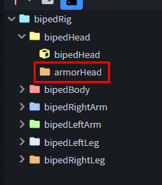
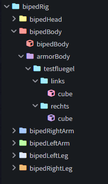
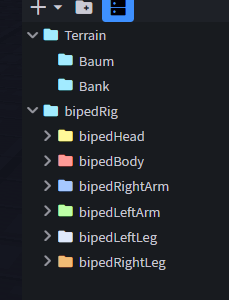
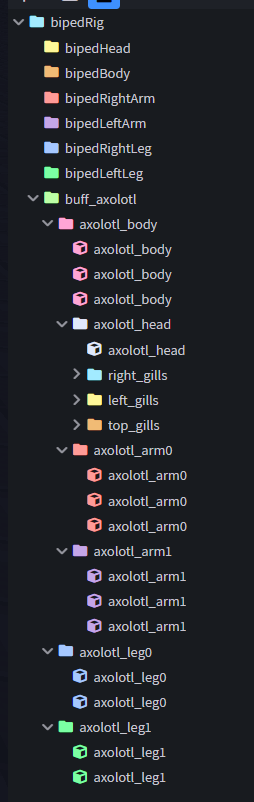
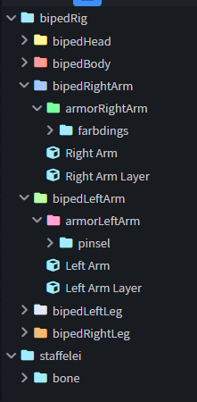

# 2. Aufbau

← [Grundlagen](01-Grundlagen) · **2 / 12** · [Model →](03-Model)

---

Gerade wenn du Emotes mit Gegenständen oder Cosmetics erstellen willst, ist die **Struktur deines Modells** besonders wichtig. Falsche Hierarchie = später nicht animierbar.

## Das 7-Knochen-System

Wir benutzen ein **6**, bzw. mittlerweile **7-Knochen-System** — heißt: alles was du erstellen willst, **muss in einen dieser Knochen**. Erkennbar sind diese Gruppen am Präfix `armor` vor dem Namen. Sie finden sich nur in den **Unterordnern** des Templates.

## Cubes richtig einsortieren

### Cubes, die sich mit dem Player bewegen

Angenommen du willst **Flügel** erstellen — dann kommen die Cubes dieser Flügel in einen eigenen Ordner, und dieser Ordner kommt in den passenden `armor`-Folder.

### Cubes außerhalb des Player-Rigs

Wenn Cubes **außerhalb** des Player-Rigs sein sollen — z.B. für **Terrain** oder Gegenstände, die sich **NICHT** mit dem Main-Rig bewegen — kommen sie in einen Ordner **außerhalb** des Rigs.

## Pivot-Punkte & Rigging

> ⚠️ **WICHTIG:** Wenn du diese später angenehm animieren willst, solltest du beim Modeln die **Pivot-Punkte der Folder richtig setzen** und alle Parts, die du animieren möchtest, **einzeln riggen** — denn du kannst nur **Folder, nicht Cubes** animieren.

---

← [Grundlagen](01-Grundlagen) · **2 / 12** · [Model →](03-Model)
