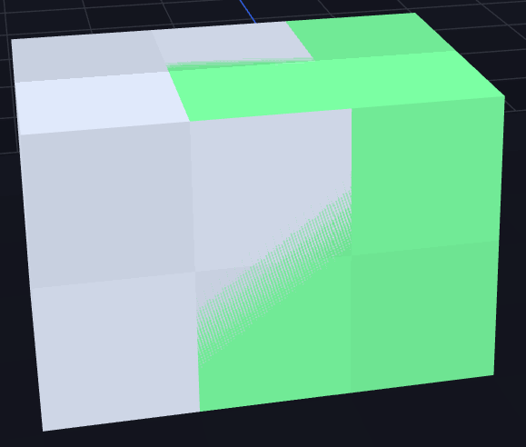
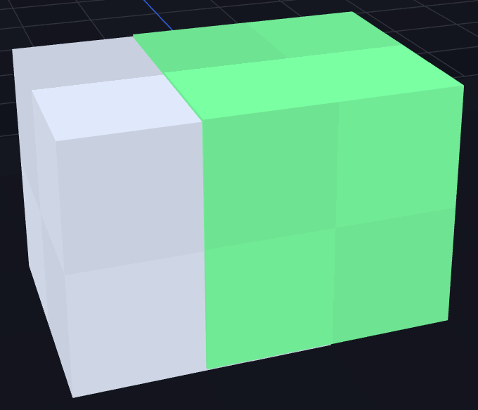

# 3. Model

← [Aufbau](02-Aufbau) · **3 / 12** · [Texture →](04-Texture)

---

Wenn du Cubes benutzt, **pass auf, dass UVs nicht übereinander liegen** — diese **buggen ingame**.

## Der Fix

Bewege überlappende UVs einfach **ganz leicht um 0.25** in eine andere Richtung. Das reicht aus, um den Bug zu vermeiden, ohne dass die Textur sichtbar leidet.

## Vergleich

### ❌ FALSCH — UVs überlappen

### ✅ RICHTIG — UVs leicht versetzt

---

← [Aufbau](02-Aufbau) · **3 / 12** · [Texture →](04-Texture)
