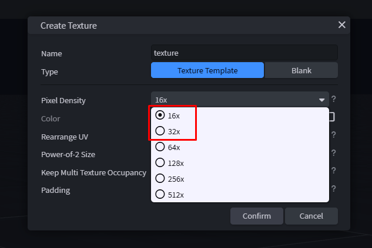

# 4. Texture

← [Model](03-Model) · **4 / 12** · [Animation →](05-Animation)

---

Nachdem du das Modell fertig hast, geht es zur **Textur**.

## Style-Guide

Die Texturen sollten im **16x** oder **32x** Spektrum gehalten werden. **Zu detailreiche** Emotes/Cosmetics passen nicht in den Style von NRC und werden voraussichtlich **nicht akzeptiert**.

---

← [Model](03-Model) · **4 / 12** · [Animation →](05-Animation)
