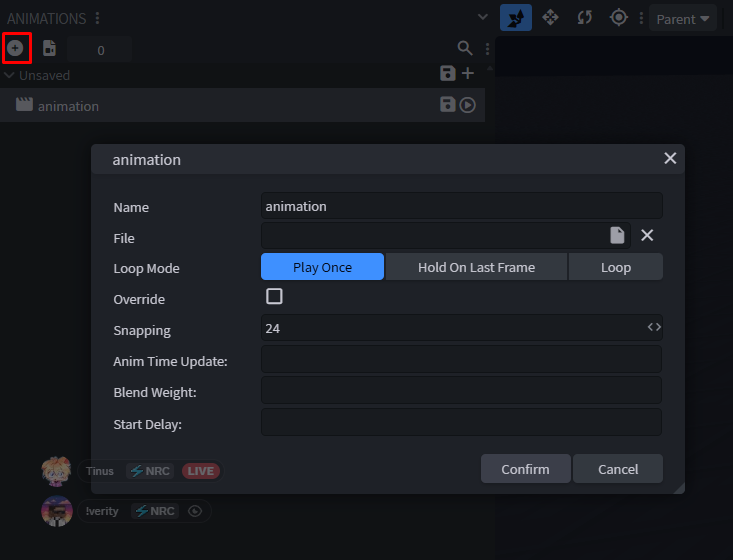
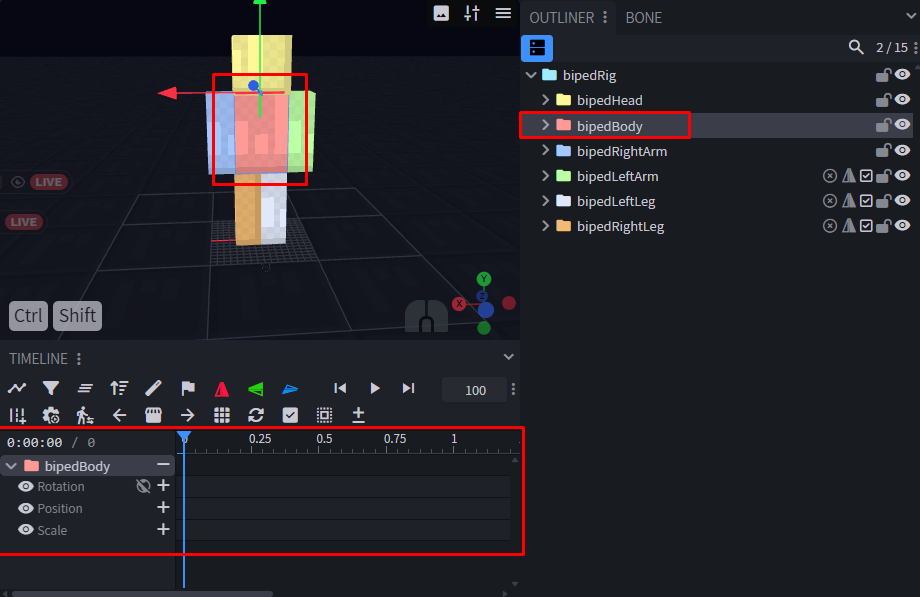
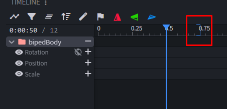

# 5. Animation

← [Texture](04-Texture) · **5 / 12** · [Keyframes →](06-Keyframes)

---

Bei der Animation beginnt der Spaß erst so richtig.

## Animation erstellen

Zuerst erstellst du eine Animation. Bei **Emotes** ist der **Name egal** — wenn es jedoch ein **Cosmetic** ist, **muss** sie `nrc.idle` heißen.

## Loop-Modi

Die drei Loop-Modi haben unterschiedliche Zwecke:

| Modus | Wann benutzen |
|-------|---------------|
| **Play Once** | Emote mit klar geschlossenem Ende |
| **Loop** | Animation soll sich unendlich wiederholen |
| **Hold On Last Frame** | End-Frame soll gehalten werden — oder am Ende läuft [Molang](07-Molang) |

## Bones in die Timeline

Klick einfach auf einen Bone — entweder im **Outliner** oder in der **Live-Preview** — und er wird unten in der **Timeline** angezeigt.

## Animationslänge

Die **blaue Klammer** schreibt das Ende der Animation vor. Du kannst sie demnach **je nach Lust und Laune verschieben**, um die Animation zu verlängern oder zu kürzen.

---

← [Texture](04-Texture) · **5 / 12** · [Keyframes →](06-Keyframes)
