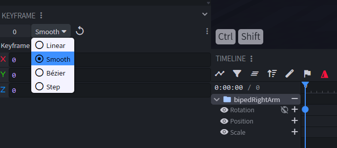
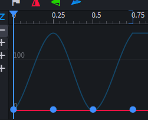
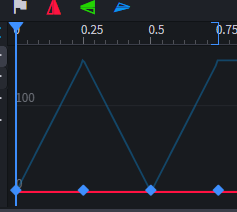
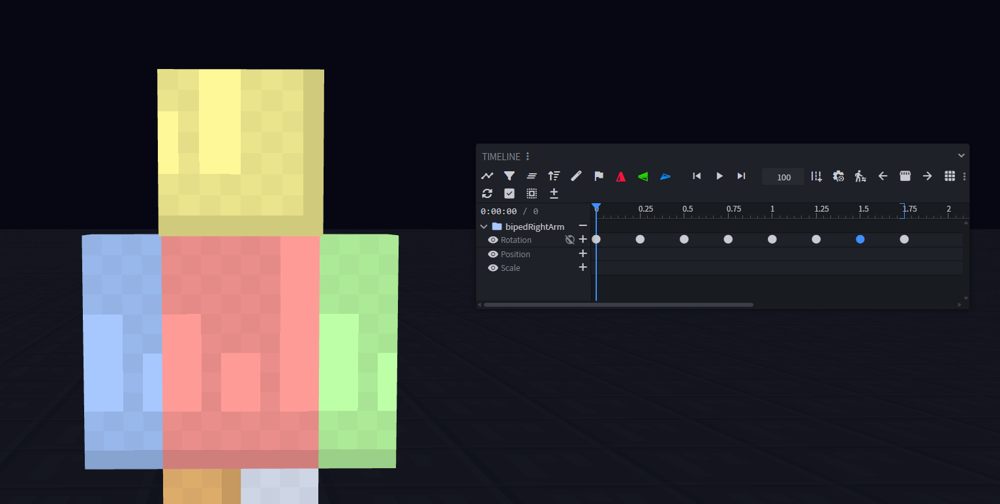
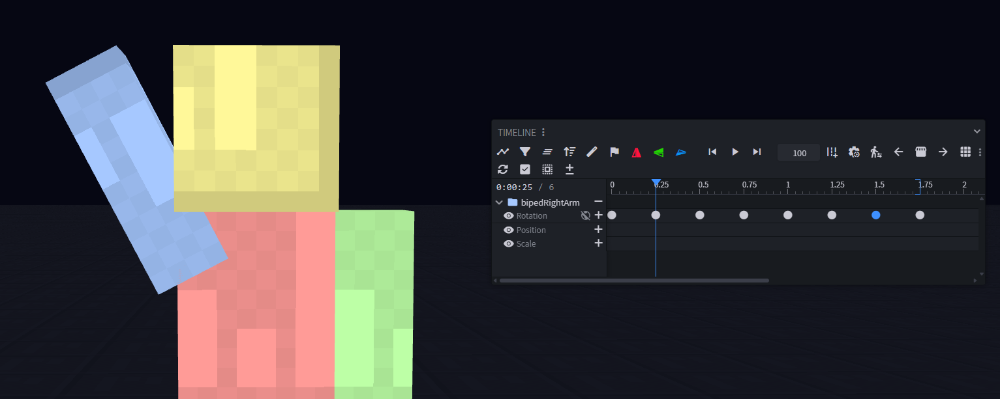
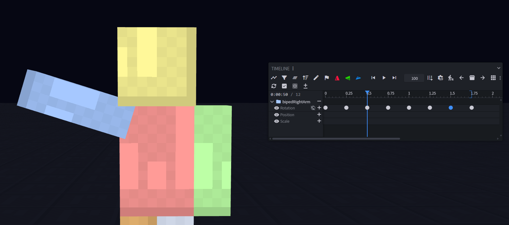
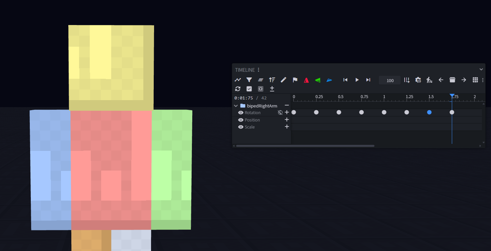
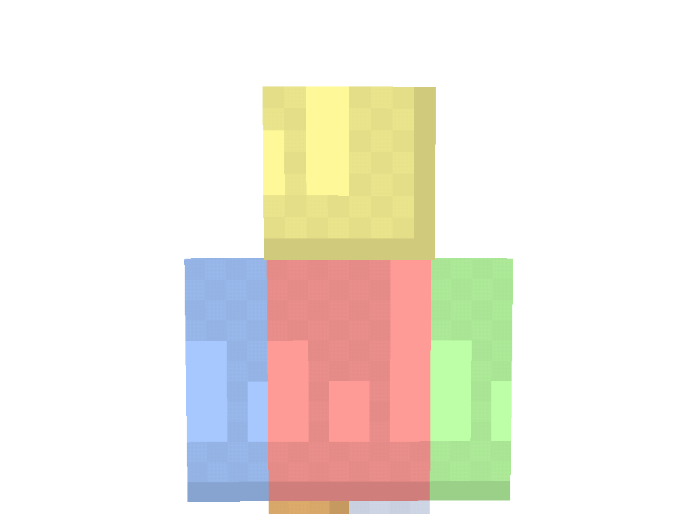

# 6. Keyframes

← [Animation](05-Animation) · **6 / 12** · [Molang →](07-Molang)

---

## Erlaubte Interpolationen

Wenn du Keyframes platzierst, kannst du zwischen **Linear** und **Smooth** wechseln. **Andere Modi werden NICHT unterstützt.**

## Visueller Unterschied

Hier siehst du den Unterschied zwischen **Smooth (1.)** und **Linear (2.)**:

## Bones bewegen

Jetzt kannst du Bones — also die Folder — **rotieren**, **positionieren** und **skalieren** wie du willst.

## Ein kleines Beispiel

**Resultat:**

---

← [Animation](05-Animation) · **6 / 12** · [Molang →](07-Molang)
