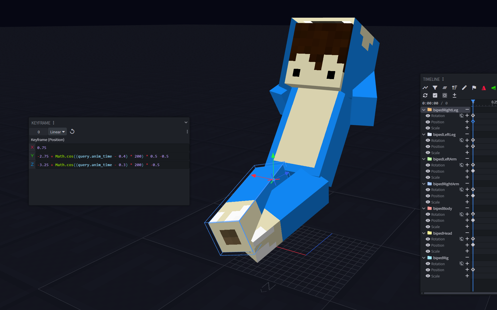
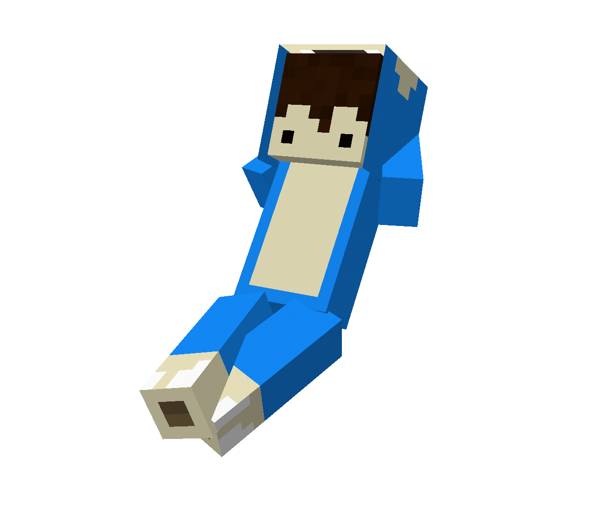
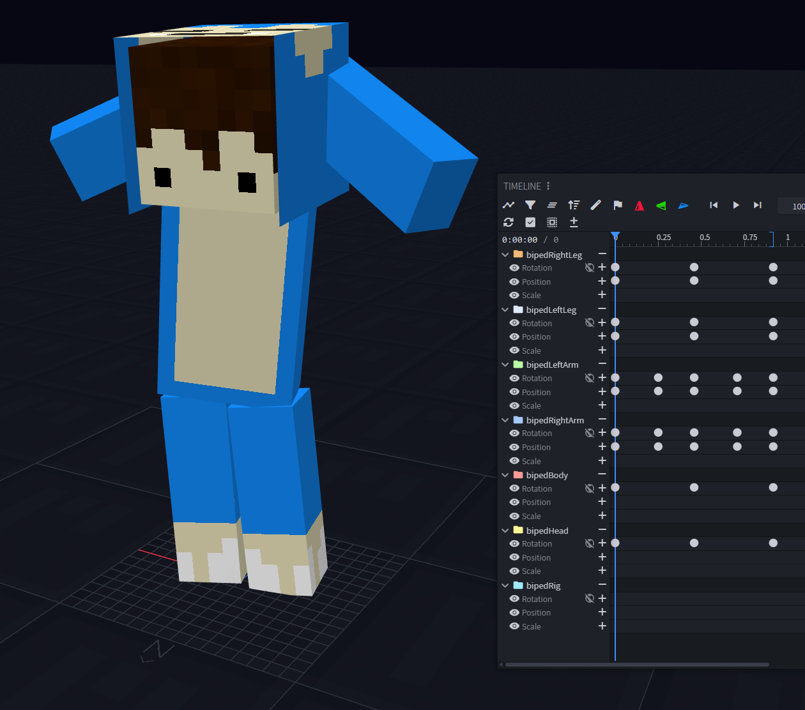
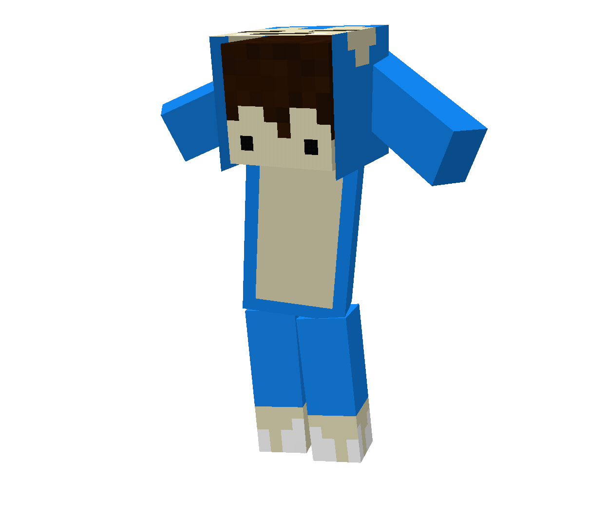
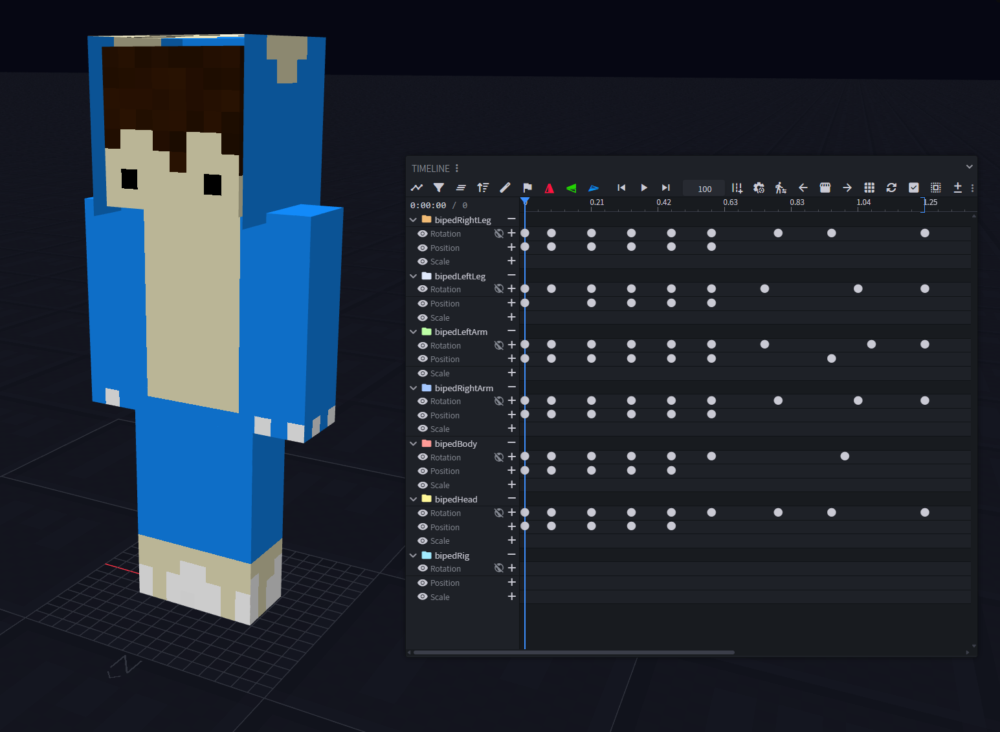
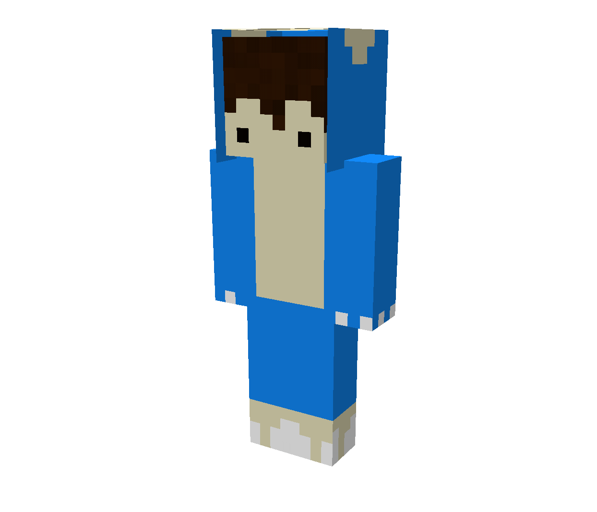

# 7. Molang

← [Keyframes](06-Keyframes) · **7 / 12** · [Particle →](08-Particle)

---

📖 **Offizielle Doku:** [GeckoLib Molang Wiki](https://github.com/bernie-g/geckolib/wiki/Molang)

## Was ist Molang?

**Molang** sind **Funktionen**, die anstelle oder zusammen mit Keyframe-Values agieren. Sie laufen quasi **unendlich weiter** und können ganz einfach für **Idle-Animationen** benutzt werden.

> 🔑 **Wichtig:** Wenn eine Animation mit einer Molang-Animation enden und unendlich weiter gehen soll, **muss die Animation am Molang-Frame enden**.

---

## Beispiele nach Loop-Modus

### Hold On Last Frame

Animation läuft einmal durch und der letzte Frame (Molang) läuft endlos weiter.

---

### Loop

Komplette Animation wiederholt sich endlos.

---

### Play Once

Animation läuft genau einmal durch und endet danach komplett.

---

← [Keyframes](06-Keyframes) · **7 / 12** · [Particle →](08-Particle)
