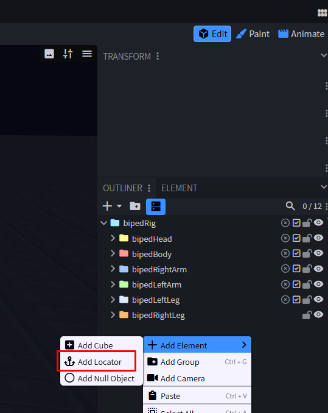
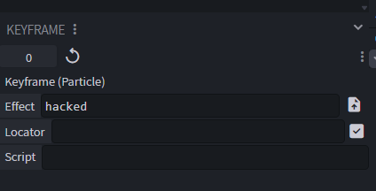

# 8. Particle

← [Molang](07-Molang) · **8 / 12** · [Sound →](09-Sound)

---

Für Particle nutzen wir **Snowstorm**. Das Tool kannst du entweder als **WebApp** oder als **VS-Code Extension** benutzen.

🔗 https://snowstorm.app/

> 💾 Speichere die fertigen Particle **immer zusammen mit ihrer Textur** ab.

---

## Particle ins Emote/Cosmetic einbinden

### 1. Locator hinzufügen

Um Particle im Emote oder Cosmetic anzuzeigen, brauchst du einen **Locator**. Diesen kannst du im **Edit Outliner** über **Rechtsklick** hinzufügen.

### 2. Animate Effects Tab öffnen

Danach brauchst du den **Animate Effects Tab** und musst einen **Keyframe in Particle** hinzufügen.

### 3. Particle-Datei verknüpfen

Im Keyframe-Panel:

1. Unter **Effect** → die **Particle-Datei** auswählen
2. Danach die **Textur** auswählen
3. Direkt darunter den passenden **Locator** auswählen

### 4. Testen

Wenn jetzt die Timeline abgespielt wird, sollten die Particle ebenfalls gezeigt werden.

---

← [Molang](07-Molang) · **8 / 12** · [Sound →](09-Sound)
