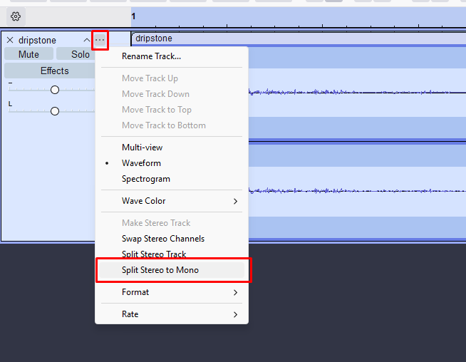
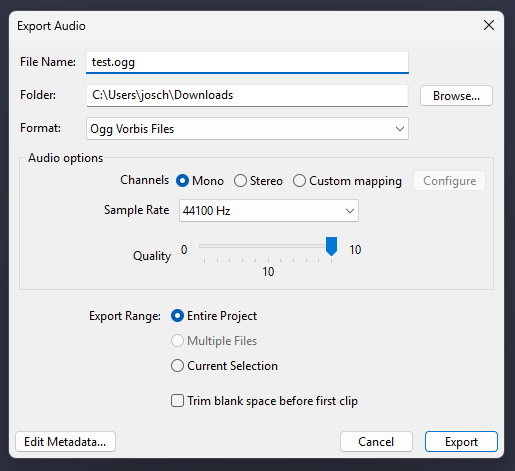
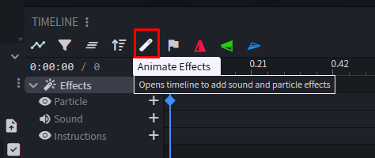
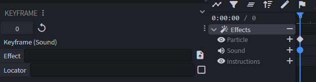
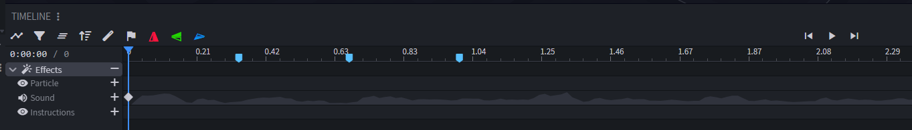

# 9. Sound

← [Particle](08-Particle) · **9 / 12** · [Export →](10-Export)

---

> ⚖️ **Rechtliches:** Für Sounds brauchst du die **Nutzungsrechte**. Verwende keine fremden, geschützten Audiodateien.

## Sound-Format

Sounds müssen folgendes Format haben:

- **Mono-Spur** (keine Stereo!)
- Dateiformat: **`.ogg`**

Beides kannst du einfach in **Audacity** einstellen.

🔗 https://www.audacityteam.org/

## Sound vorbereiten in Audacity

## Sound im Modell einbinden

### 1. Animate Effects Tab

Wie bei [Particle](08-Particle), aber dieses Mal den **Sounds**-Tab statt Particle nutzen.

### 2. Sound-Datei verknüpfen

Die Sound-Datei kann ganz einfach unter **Effect** hinzugefügt werden — danach erscheint sie in der Timeline.

---

← [Particle](08-Particle) · **9 / 12** · [Export →](10-Export)
