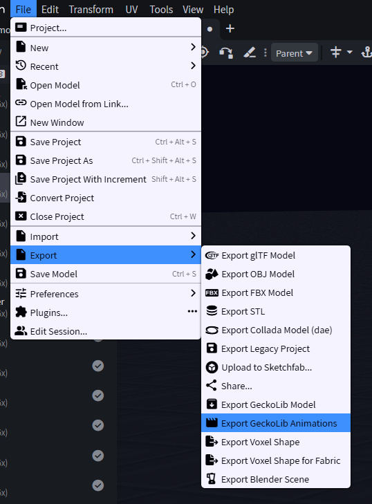
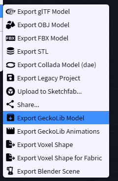
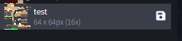

# 10. Export

← [Sound](09-Sound) · **10 / 12** · [Test-Setup →](11-Test-Setup)

---

Zum Exportieren erstellst du am besten erstmal einen **Ordner**, den du einfach wiederfindest.

## Emote nur mit Animation

Wenn dein Emote **ausschließlich Animation** enthält, musst du es nur als **GeckoLib Animations** exportieren.

## Cosmetic oder Emote mit Sound / Cubes / Particle

Wenn es ein **Cosmetic** ist oder ein **Emote mit Sound, Cubes oder Particle**, brauchst du zusätzlich:

- **GeckoLib Model** (`.geo.json`)
- **Texture** (`.png`)
- Alle weiteren Dateien:
  - Sound (`.ogg`)
  - Particle (`.json`)
  - Particle Texture (`.png`)

Alles wandert in **denselben Ordner**.

---

← [Sound](09-Sound) · **10 / 12** · [Test-Setup →](11-Test-Setup)
