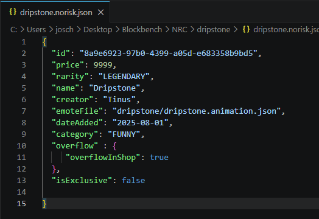
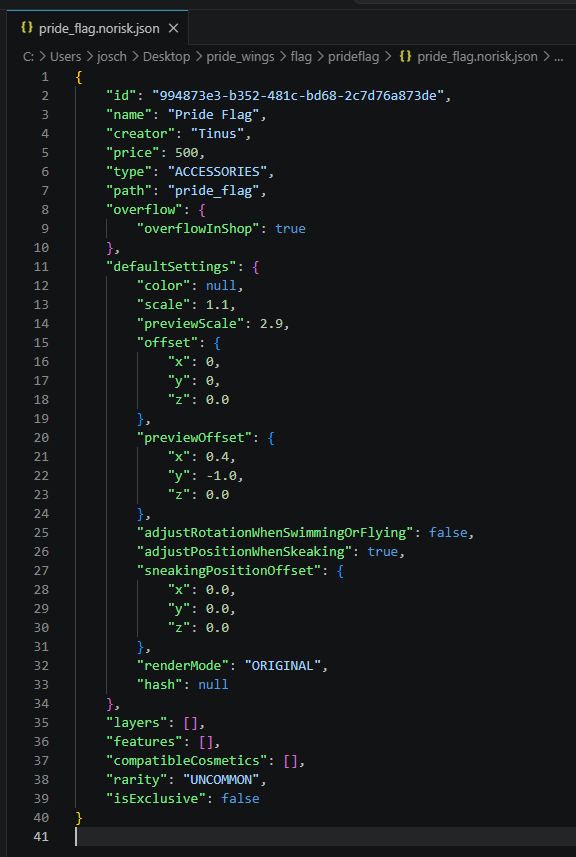
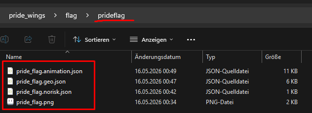
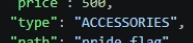
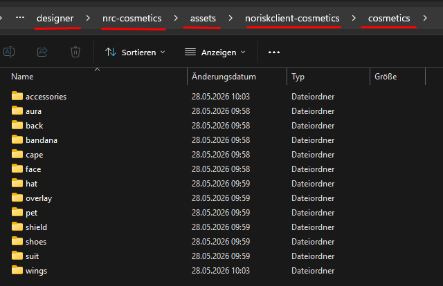
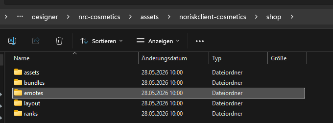
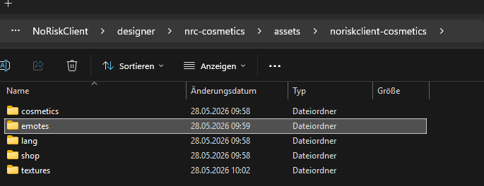

# 11. Test-Setup

← [Export](10-Export) · **11 / 12** · [Ingame-Test →](12-Ingame-Test)

---

Um alles ingame testen zu können, brauchst du eine **`{name}.norisk.json`** Datei.

Du kannst sie entweder **selbst schreiben** oder **aus einer existierenden Datei kopieren** und alle wichtigen Felder anpassen.

## Vorbereitung

Zuerst kopieren wir die **Game-Assets** — also den gesamten **`nrc-cosmetics` Folder** — in den **`NoRiskClient/designer`** Ordner.

### 📥 Download

Den Ordner musst du dir nicht selbst zusammensuchen — wir stellen ihn als ZIP bereit:

> **[⬇ nrc-cosmetics.zip herunterladen](https://github.com/NoRiskClient/nrc-designer-docs/releases/latest/download/nrc-cosmetics.zip)** *(ca. 670 KB, immer aktueller Stand)*

> ⚙️ Das ZIP wird **automatisch** aus dem [Source-Repo](https://github.com/NoRiskClient/nrc-designer-docs/tree/main/designer) gebaut. Bei jeder Änderung am Designer-Ordner gibt's ein neues Release — du hast also immer die aktuelle Version. Alle Versionen: [Releases](https://github.com/NoRiskClient/nrc-designer-docs/releases).

**Schritte:**

1. ZIP herunterladen
2. Entpacken — du erhältst den Ordner `nrc-cosmetics/`
3. Den **gesamten Ordner** nach `NoRiskClient/designer/` kopieren
4. Deine eigenen Emote- / Cosmetic-Files an die richtigen Stellen einsortieren (siehe unten)

---

## `{name}.norisk.json` — Emotes

Die `.norisk.json` für Emotes ist deutlich übersichtlicher als die für Cosmetics. Du musst vor allem folgendes setzen:

- `id` — eindeutige UUID
- `name` — Anzeigename
- `emoteFile` — Pfad zur Animation
- `creator` — dein Name
- `category`
- `price` / `rarity`

🔧 **UUID-Generator:** https://www.uuidgenerator.net/

```json
{
  "id": "8a9e6923-97b0-4399-a05d-e683358b9bd5",
  "price": 9999,
  "rarity": "LEGENDARY",
  "name": "Dripstone",
  "creator": "Tinus",
  "emoteFile": "dripstone/dripstone.animation.json",
  "dateAdded": "2025-08-01",
  "category": "FUNNY",
  "overflow" : {
     "overflowInShop": true
  },
  "isExclusive": false
}
```



---

## `{name}.norisk.json` — Cosmetics

Für Cosmetics wird die Datei länger, da hier zusätzlich **Scale**, **Preview** und Dinge wie das **Shop-Layout** eingestellt werden.

```json
{
    "id": "994873e3-b352-481c-bd68-2c7d76a873de",
    "name": "Pride Flag",
    "creator": "Tinus",
    "price": 500,
    "type": "ACCESSORIES",
    "path": "pride_flag",
    "overflow": {
        "overflowInShop": true
    },
    "defaultSettings": {
        "color": null,
        "scale": 1.1,
        "previewScale": 2.9,
        "offset": {
            "x": 0,
            "y": 0,
            "z": 0.0
        },
        "previewOffset": {
            "x": 0.4,
            "y": -1.0,
            "z": 0.0
        },
        "adjustRotationWhenSwimmingOrFlying": false,
        "adjustPositionWhenSkeaking": true,
        "sneakingPositionOffset": {
            "x": 0.0,
            "y": 0.0,
            "z": 0.0
        },
        "renderMode": "ORIGINAL",
        "hash": null
    },
    "layers": [],
    "features": [],
    "compatibleCosmetics": [],
    "rarity": "UNCOMMON",
    "isExclusive": false
}
```



---

## Files einsortieren

### Cosmetics

Die `.norisk.json` für Cosmetics kommt in **denselben Ordner** wie die restlichen Files.



Der gesamte Ordner wandert in den passenden ingame Ordner — der Pfad muss zum `path`-Feld in deiner `.norisk.json` passen:





### Emotes

Für Emotes hast du **zwei verschiedene Dateien**:

**1. Die `.norisk.json`** — kommt in den `shop/emotes` Ordner:



**2. Die `.animation.json`** (oder je nach Emote der ganze Ordner mit `.geo` / `.animation` / `.png` / Particle / Sound etc.) — kommt in den `emotes` Ordner:



---

← [Export](10-Export) · **11 / 12** · [Ingame-Test →](12-Ingame-Test)
