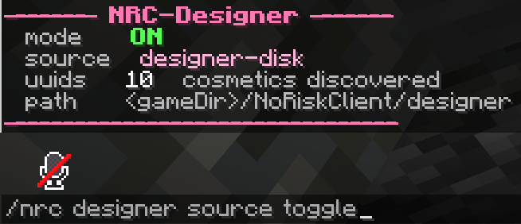
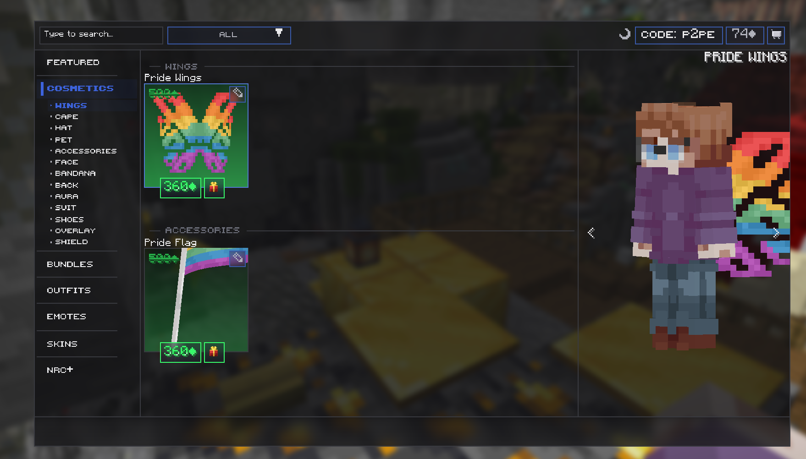
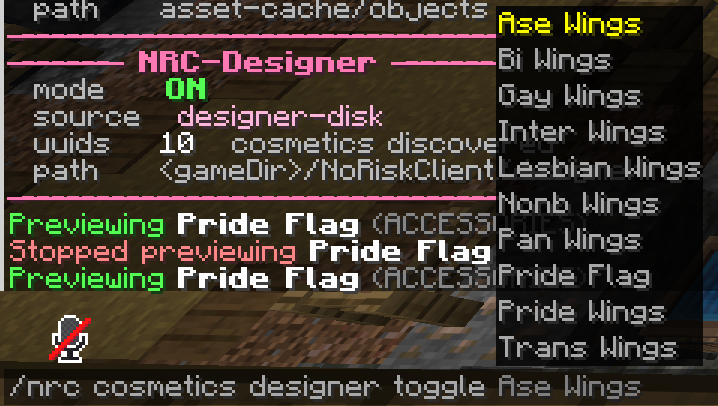
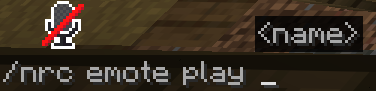

# 12. Ingame-Test

← [Test-Setup](11-Test-Setup) · **12 / 12** · [🏠 Home](Home)

---

Je nach Permissions kannst du nun folgenden Command ausführen, um auf den neu angelegten Designer-Ordner zuzugreifen:

```
/nrc designer source toggle
```



## Im Shop sehen

Wenn du alles richtig gemacht hast, sollten jetzt deine Cosmetics und Emotes **im Shop** angezeigt werden:



## Local Test — Cosmetics ausrüsten

Du kannst Cosmetics auch **local** testen — also ausrüsten ohne sie wirklich zu besitzen:

```
/nrc cosmetics designer toggle <name>
```



## Local Test — Emotes abspielen

Emotes natürlich genauso:

```
/nrc emote play <name>
```



---

## Fertig! 🎉

**Viel Spaß beim Testen :3**

— Tinus aka. p2pe ❤️

---

← [Test-Setup](11-Test-Setup) · **12 / 12** · [🏠 Home](Home)
